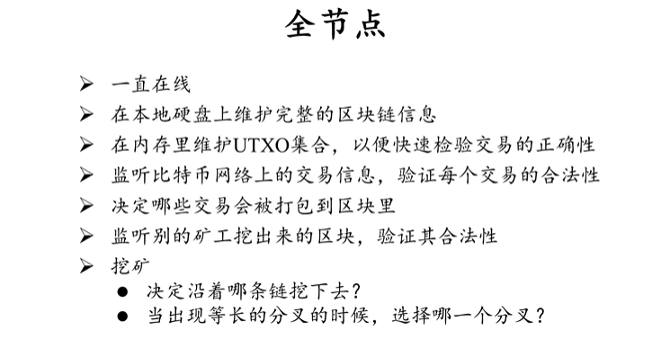

### 之前内容总结

1. 全节点

   

2. 轻节点

   

### 挖矿

当正在挖的区块被别的节点抢先找到时，那么这时只有重新开始挖新的区块。

这很可惜吗？

不，因为挖坑过程具有无记忆性，无论是继续挖已经出了的块，还是新的块，挖出的概率是一样的。

而且，就算挖出之后，也可能由于非最长合法链、受双花攻击影响等等使得挖出的块无效。

试想一下，作为普通群众，有什么资本（算力）去和那些大型矿场去比呢？

总之，一句话：挖矿有风险，入坑需谨慎。

因此，对于单个矿工来说，挖矿更类似于买彩票，收益十分不稳定。

这就产生了矿池。

### 矿池

使用一个称为（pool manager）的全节点管理很多独立的矿工。

每个矿工只负责计算哈希值，即求解问题。而其它如管理和验证交易信息，消息传播等职责全部交给池管理机器来做。

由于挖矿难度的提升，目前大多数对于问题求解的工作都交给了 ASIC 芯片，这种芯片只可以计算哈希值，而不能提供全节点应有的功能，因此产生了矿池。

再根据上面的叙述，矿池的出现还解决了收益不稳定的问题。

整个矿池的收益按算力分配（工作量证明），具体思路如下：

矿工在寻找 nonce 过程中，会找到一些相比于 nonce 难度更小的 share。

比如真正的 target 哈希前面有 70 个 0，这是找到 nonce 的难度，而找到 share 只要求 target^ 前面有 60 个 0，这时根据 share 可生成的区块称为（almost valid block）。

由于寻找 nonce 过程中必定也会找到 share，因此矿池的主人—矿主，就可以在一个矿工找到了 nonce 时，再根据每一个矿工已找到 share 的数量（工作量证明）向每一个矿工分配这个出块收益。

而且，由于每个矿工的任务都是矿主分配的，具体地说，根据之前学习的，挖矿时除了调整 nonce，还需要调整 coin base 中的第一条交易的内容，即挖矿有两层循环。

因此，矿主负责调整第一层循环中的 extra nonce（通过修改 coin base 域的一部分字节），将第一笔铸币交易的收款人地址写成自己的，向每个矿工告知不同的 coin base 对应的 nonce 的范围。

矿工负责根据矿主提供的 nonce 范围，调整第二层中的 nonce。

所以，对于以下几种特殊情况的描述如下：

1. 假如有一个矿工找到了 nonce，它是不可能自己来发布这个新区块的，因为 coin base 域的内容是矿主控制的，特别是收款人地址这个参数，矿工得不到出块和交易费等任何收益。

2. 假如矿工偷偷换掉了矿主提供的 coin base，那么矿主是不会认矿工找到的 share 的，这又和自己挖矿没有区别了。
3. 假如矿工找到 nonce 不告诉矿主偷偷扔掉，这是普遍存在的，且没法解决。

妙啊~

然而，矿池的出现也带来了一些更加严重的问题（技术上去中心化，业务上中心化，矿池是中心化的业务）。

矿池减轻了矿工的负担，使矿工的工作模式成为了（on demand mining）

但是由于其本质上是中心化的，这违背了比特币的初心，容易发送矿池垄断的现象。

恶意矿池通过减少管理费等手段吸引矿工，可以更加容易的发动 “51%” 攻击。

当一个矿池占据了整个系统绝大部分算力时，可以发动的 “51%” 攻击如下：

1. 分叉攻击：之前学过。
2. 封锁（Boycott）：封锁一个比特币账号，使其相关交易无法上链。与分叉不同的是，无需等待六个确认。