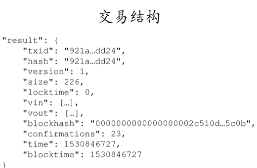
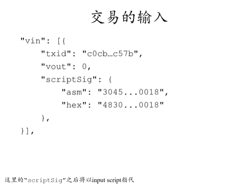
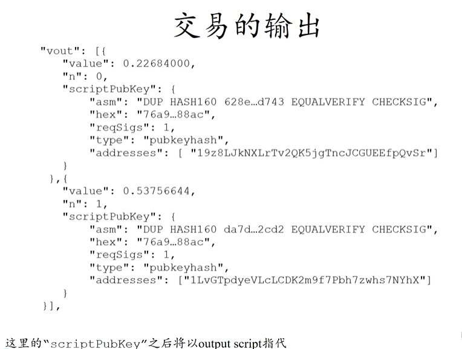

### 交易实例

一个输入，五个输出。

已收到 1 个确认。

中间的 9.43... 可链接到这个输入的输出来源，详细如下：

比特币的脚本语言只使用了栈，输出脚本与输入一一对应。

### 交易内容（图源为视频，与上面的不对应）

交易结构：

其中的 vin，vout 指的是输入输出部分。

txid（来源交易 id 和 hash） 和 vout(来源交易的第几个输出) 给出输入的币的来源。

asm 是输入脚本的内容，hex 则是对应的哈希。

vin 是一个数组，所以可能有多个。

regSigs 指的是输出需要多少签名才可以兑现。

type 是输出类型。

### 输入和输出脚本的几种形式（不做深入了解）

P2PK

P2PKH

P2SH

多重签名

P2SH 多重签名

Proof of Burn

