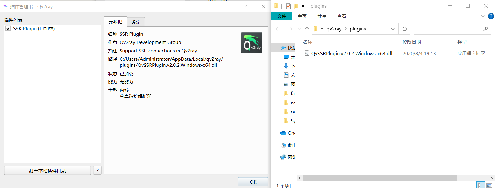

# 在 WIndows10 利用 WSL2 部署 Hyperledger Fabric 开发环境

## 准备工作

#### VPN

1.  下载并安装[Qv2ray](https://github.com/Qv2ray/Qv2ray/releases)，加速代理自行购买

2.  下载 [V2ray-core](https://github.com/v2ray/v2ray-core/releases)，重命名为 *vcore* 并在 Qv2ray 中安装

    

3.  如果使用 SSR 需要另行安装 [Qv2ray-SSR 插件](https://github.com/Qv2ray/QvPlugin-SSR/releases)

    

4.  设置 Qv2ray 选项

    

    

#### 虚拟机

1.  开启服务：程序与功能中开启 Hyper-V、虚拟机平台，重启 Windows
2.  安装 VMware 和 Ubuntu 20.04 LTS Server

#### 镜像加速

1.  apt 清华源

    ```shell
    sudo nano /etc/apt/sources.list
    ```

    注释掉或者删掉原本的 ubuntu 的官方源，注意 docker 那一行不要误删掉，替换成以下：

    ```
    # 默认注释了源码镜像以提高 apt update 速度，如有需要可自行取消注释
    deb https://mirrors.tuna.tsinghua.edu.cn/ubuntu/ focal main restricted universe multiverse
    # deb-src https://mirrors.tuna.tsinghua.edu.cn/ubuntu/ focal main restricted universe multiverse
    deb https://mirrors.tuna.tsinghua.edu.cn/ubuntu/ focal-updates main restricted universe multiverse
    # deb-src https://mirrors.tuna.tsinghua.edu.cn/ubuntu/ focal-updates main restricted universe multiverse
    deb https://mirrors.tuna.tsinghua.edu.cn/ubuntu/ focal-backports main restricted universe multiverse
    # deb-src https://mirrors.tuna.tsinghua.edu.cn/ubuntu/ focal-backports main restricted universe multiverse
    deb https://mirrors.tuna.tsinghua.edu.cn/ubuntu/ focal-security main restricted universe multiverse
    # deb-src https://mirrors.tuna.tsinghua.edu.cn/ubuntu/ focal-security main restricted universe multiverse
    ```

    Ctrl+X -> Y 退出编辑，然后：

    ```shell
    sudo apt update
    sudo apt-get update
    ```

2.  docker 阿里云源

    打开阿里云[容器镜像服务页](https://cn.aliyun.com/product/acr)获取自己的加速地址，然后执行：

    ```shell
    sudo mkdir -p /etc/docker
    sudo tee /etc/docker/daemon.json <<-'EOF'
    {
      "registry-mirrors": ["https://0zw1g36i.mirror.aliyuncs.com"]
    }
    EOF
    ```

#### 软件源添加

1.  Docker

    ```shell
    # 安装工具让apt可以支持HTTPS方式获取包
    sudo apt install apt-transport-https ca-certificates curl software-properties-common
    # 将官方Docker库的GPG公钥添加到系统中
    curl -fsSL https://download.docker.com/linux/ubuntu/gpg | sudo apt-key add -
    # 将Docker库添加到apt里
    sudo add-apt-repository "deb [arch=amd64] https://download.docker.com/linux/ubuntu bionic stable"
    # 再次更新下apt库列表
    sudo apt update
    # 开始安装docker-ce
    sudo apt install docker-ce
    
    # 安装完成查询版本号
    docker --version
    # 为 docker 添加当前用户
    sudo service docker start
    sudo usermod -aG docker $USER
    # 开始安装docker-compose
    sudo apt install docker-compose
    
    # 安装完成后查询docker-compose版本号
    docker-compose --version
    ```

2.  Golang

    ```shell
    sudo add-apt-repository ppa:longsleep/golang-backports
    sudo apt-get update
    sudo apt-get install golang
    
    ```
    
    设置 golang 环境变量，先查看 golang 安装路径
    
    ```shell
    $ whereis go
    go: /usr/bin/go /usr/lib/go /usr/share/go /usr/lib/go-1.15/bin/go /usr/share/man/man1/go.1.gz
    ```
    
    新建 GOPATH
    
    ```shell
    mkdir ~/GOPATH
    ```
    
    修改 .bashrc：
    
    ```shell
    nano ~/.bashrc
    ```
    
    在文件末尾添加:
    
    ```shell
    export GOROOT=/usr/lib/go # GOROOT是系统上安装 Go 软件包的位置。
    export GOPATH=/home/<your username>/GOPATH # GOPATH 是刚刚新建的工作目录的位置。
    export PATH=$GOPATH/bin:$GOROOT/bin:$PATH
    ```
    
    激活 .bashrc 并设置 go 代理
    
    ```shell
    source  ~/.bashrc
    go version
    sudo go env -w GO111MODULE=on
    sudo go env -w GOPROXY=https://goproxy.cn,direct
    ```

#### 配置 root 账户

1.  设置好 root 密码

    ```shell
    sudo passwd root
    ```

2.  修改 ssh 配置

    ```shell
    sudo nano /etc/ssh/sshd_config
    ```

    找到对应行进行修改

    ```yaml
    # ...
    Port 22
    # ...
    PermitRootLogin yes
    # ...
    PasswordAuthentication yes
    # ...
    ```

    初始化 ssh-key

    ```shell
    sudo ssh-keygen -A
    ```

    启动 ssh 服务

    ```shell
    sudo service ssh start
    ```

#### 设置静态 IP

由于 VMware 网络适配器基于 NAT，每次重启都会重新设置 IP，这对于代理加速、SSH 连接以及程序开发调试都很不方便，因此需要在 Windows 启动时自动设置静态 IP

## 部署 Fabric 环境

#### 安装依赖软件

```shell
sudo apt install python3 python nodejs npm
```

#### 安装 Fabric

1.  下载 [bootstrap.sh](https://raw.githubusercontent.com/hyperledger/fabric/master/scripts/bootstrap.sh)，使用 ftp 传到 WSL 中

2.  开启加速代理，启动 docker 服务，执行脚本

    ```shell
    sudo service docker start
    mkdir ~/Project
    cd ~/Project
    bash ~/bootstrap.sh -s -d
    sudo bash ~/bootstrap.sh -s -b
    ```
    
3.  下载完成之后目录会出现 bin/ 和 config/ 文件夹

    ```shell
    sudo cp bin/* /usr/bin/
    # 执行以下不出错则配置成功
    configtxgen version  
    configtxlator version 
    cryptogen version 
    fabric-ca-client version 
    fabric-ca-server version 
    idemixgen version 
    orderer version 
    peer version
    discover --help
    ```
    
4.  测试

    参考 [test-network](https://hyperledger-fabric.readthedocs.io/en/latest/test_network.html)
    
    ```shell
    cd ~/Project/
    git clone -b v2.1.1 https://github.com/hyperledger/fabric-samples
    cd fabric-samples
    cp ../bin -r ./bin
    cp ../config -r ./config
    cd test-network/
    sudo ./network.sh -h
    ```
    
    参考官方测试流程即可
    
    **到此，Fabric 环境部署完成**
## 配置 Fabric Win 开发环境

#### Go 开发环境

1.  安装 Golang
2.  配置 Go 环境变量
3.  安装 Go-SDK

#### 配置远程调试环境

#### 测试开发环境